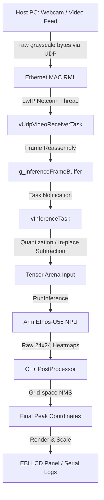

# Edge AI Overhead People Counting with the NuMaker-X-M55M1D

This repository contains highly optimized firmware for the Nuvoton NuMaker-X-M55M1D evaluation board to execute a custom overhead people counting model. The system uses hardware acceleration on the Arm Ethos-U55 NPU and processes video streams received over the network via a UDP server.

This project is optimized for both Keil MDK and the Arm CMSIS / csolution VS Code Extensions, allowing direct compilation, flashing, and debugging inside VS Code.

---

## System Architecture Overview



---

## Installation

Use the installation script of essential libraries from the official developer [repository](https://github.com/OpenNuvoton/ML_M55M1_SampleCode).

You will need `Library` and `ThirdParty` paths available at an accessible location, such as `C:/Library` and `C:/ThirdParty` (~600MB disk space required).

---

## Model Setup

[Download pre-trained weights (APGL 3.0)](https://huggingface.co/bdanko/fomo-overhead-people-counting/resolve/main/model_192x192_ethos_u55_int8.tflite?download=true).  

Please place the model file at the root of the repository as `model.tflite`.

### Model Parameters
* Input Tensor: `[1, 192, 192, 1]` (int8 quantized)
* Output Tensor: `[1, 24, 24, 2]` (int8 quantized, Class 0: Background, Class 1: Person)

### Memory Mapping (M55M1.scatter)
* Model ROM location: Copied from the SD Card (`0:\model.tflite`) directly into high-speed HyperRAM at address `0x82400000` during initialization to conserve internal SRAM.
* Tensor Arena (Activation Buffer): `0x00100000` (1 MB) allocated in internal high-speed SRAM with Cache policy set to Write-Through, Read-Allocate (WTRA).
* Frame Buffers: Double buffered `g_networkFrameBuffer` and `g_inferenceFrameBuffer` (36.8 KB each) placed in SRAM2 (`.bss.vram.data` region) to support uncached, zero-copy, race-free transfers.

---

## VS Code & CMSIS Path Configuration

If you are using the Arm CMSIS VS Code Extension (which autodetects Keil `.uvprojx` projects and builds/runs them natively in VS Code), you must configure the include and link paths to match your local installation of the Nuvoton SDK (`Library` and `ThirdParty` folders).

Use the path configuration utility `configure_paths.py` in the root of the repository before opening the project in VS Code:

```bash
python3 configure_paths.py --library "C:\Library" --thirdparty "C:\ThirdParty"
```

Once configured, open this repository folder inside VS Code. The Arm CMSIS Extension will automatically detect the project, configure its internal build configurations, and let you compile and flash the firmware natively.

---

## Host Video Streaming Pipeline (stream_udp.py)

To achieve maximum performance and zero decompression overhead on the Cortex-M55 core, the PC streams raw, 1-channel grayscale bytes (`192x192 = 36,864` bytes). This avoids hardware JPEG decoding stalls and completely bypasses software decoding overhead.

### Installation of Host Dependencies
Ensure you have `opencv-python` installed:
```bash
pip install opencv-python
```

### Running the Streamer
Stream a live feed from the default webcam (`0`):
```bash
python3 stream_udp.py --ip 192.168.1.10 --port 5005 --source 0 --fps 15
```

Or stream a video file:
```bash
python3 stream_udp.py --ip 192.168.1.10 --port 5005 --source "path/to/elevator_feed.mp4" --fps 15
```

---

## Repository Structure & Key Locations

The project resources are organized at the root of the workspace:

* `board_config.h`: Central configuration header. Controls Static IP, Port, Logging, and thresholds.
* `main.cpp`: Application entry and scheduler coordinator. Drives the UDP receiver and inference tasks.
* `BoardInit.cpp`: Clock and peripheral initialization. Sets up system clocks, Ethernet RMII, NPU, and HyperRAM.
* `model/`: Directory containing deep learning operations (model resolvers and post-processing).
* `model/PostProcessor.cpp`: C++ post-processor handling grid scanning, dequantization, and Euclidean NMS.
* `model/InferenceModel.cpp`: TFLite Micro model resolver for NPU and fallback operators.
* `stream_udp.py`: PC Host video streamer.
* `configure_paths.py`: Project path configurator for Keil/CMSIS.
* `KEIL/`: Directory containing Keil MDK configuration files and scatter maps.

---

## Logging & Serial Communication

You can monitor performance, network connectivity, and real-time counts through the debug serial terminal (115200-8N1) using the logging framework.

### Toggle Logging
Logging can be fully toggled or customized in `board_config.h`:
```cpp
#define ENABLE_SERIAL_LOGS         1   // Toggle 1 to enable, 0 to disable
#define ENABLE_INFO_LOGS           1   // Detailed logs [INFO]
#define ENABLE_ERR_LOGS            1   // Error logs [ERROR]
```

### Serial Log Output Example
```text
[INFO] Hardware peripherals initialized.
[INFO] Initializing Arm Ethos-U55 NPU...
[INFO] Target system: NuMaker-X-M55M1D
[INFO] Network stack successfully initialized.
[INFO] IP address:      192.168.1.10
[INFO] Subnet mask:     255.255.255.0
[INFO] Default gateway: 192.168.1.1
[INFO] UDP server listening on port 5005...
[INFO] Opening model file: 0:\model.tflite
[INFO] Model file size: 64464 bytes
[INFO] Model successfully loaded to HyperRAM.
[INFO] Inference Engine started. Waiting for incoming network video feed...
[INFO] [STATUS] Real-time inference rate: 15 FPS | Active People: 2
[INFO] [STATUS] Real-time inference rate: 15 FPS | Active People: 3
```
