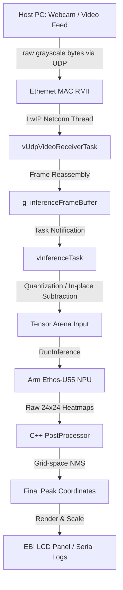

# Edge AI Overhead People Counting with the NuMaker-X-M55M1D

This repository contains highly optimized firmware for the Nuvoton NuMaker-X-M55M1D evaluation board to execute a custom overhead people counting model. The system uses hardware acceleration on the Arm Ethos-U55 NPU and processes video streams received over the network via a UDP server.

This project is optimized for both Keil MDK and the Arm CMSIS / csolution VS Code Extensions, allowing direct compilation, flashing, and debugging inside VS Code.

---

## System Architecture Overview



---

## Installation

To compile this project, you need the official Nuvoton M55M1 Board Support Package (BSP) containing the complete and untrimmed `Library` and `ThirdParty` dependencies (~1GB disk space).

1. Clone the Official Nuvoton M55M1 BSP Repository:
   Clone the repository to an accessible location on your machine (e.g., `C:\M55M1BSP`):
   ```cmd
   git clone https://github.com/OpenNuvoton/M55M1BSP.git C:\M55M1BSP
   ```

2. Configure the Project Paths:
   Use the `configure_paths.py` utility to dynamically map your project files to the newly cloned BSP directories:
   ```bash
   python3 configure_paths.py --library "C:\M55M1BSP\Library" --thirdparty "C:\M55M1BSP\ThirdParty"
   ```

3. Prepare Model Weights:
   Download the pre-trained FOMO model weights:
   * [Download pre-trained weights (APGL 3.0)](https://huggingface.co/bdanko/fomo-overhead-people-counting/resolve/main/model_192x192_ethos_u55_int8.tflite?download=true)
   
   Place the downloaded `.tflite` file at the root of this repository and rename it to `model.tflite`.

4. Build and Flash:
   Install the [Arm CMSIS Solution](https://marketplace.visualstudio.com/items?itemName=Arm.cmsis-csolution). Open the `KEIL/` directory and select `Build solution` and `Load and run application`.

### Running the Streamer

Stream a live feed from the default webcam (`0`):
```bash
python3 stream_udp.py --ip 192.168.1.10 --port 5005 --source 0 --fps 15
```

Or stream a video file:
```bash
python3 stream_udp.py --ip 192.168.1.10 --port 5005 --source "path/to/elevator_feed.mp4" --fps 15
```

---

## Repository Structure & Key Locations

The project resources are organized at the root of the workspace:

* `board_config.h`: Central configuration header. Controls Static IP, Port, Logging, and thresholds.
* `main.cpp`: Application entry and scheduler coordinator. Drives the UDP receiver and inference tasks.
* `BoardInit.cpp`: Clock and peripheral initialization. Sets up system clocks, Ethernet RMII, NPU, and HyperRAM.
* `model/`: Directory containing deep learning operations (model resolvers and post-processing).
* `model/PostProcessor.cpp`: C++ post-processor handling grid scanning, dequantization, and Euclidean NMS.
* `model/InferenceModel.cpp`: TFLite Micro model resolver for NPU and fallback operators.
* `stream_udp.py`: PC Host video streamer.
* `configure_paths.py`: Project path configurator for Keil/CMSIS.
* `KEIL/`: Directory containing Keil MDK configuration files and scatter maps.

---

## Logging & Serial Communication

You can monitor performance, network connectivity, and real-time counts through the debug serial terminal (115200-8N1) using the logging framework.

### Toggle Logging
Logging can be fully toggled or customized in `board_config.h`:
```cpp
#define ENABLE_SERIAL_LOGS         1   // Toggle 1 to enable, 0 to disable
#define ENABLE_INFO_LOGS           1   // Detailed logs [INFO]
#define ENABLE_ERR_LOGS            1   // Error logs [ERROR]
```

### Serial Log Output Example
```text
[INFO] Hardware peripherals initialized.
[INFO] Initializing Arm Ethos-U55 NPU...
[INFO] Target system: NuMaker-X-M55M1D
[INFO] Network stack successfully initialized.
[INFO] IP address:      192.168.1.10
[INFO] Subnet mask:     255.255.255.0
[INFO] Default gateway: 192.168.1.1
[INFO] UDP server listening on port 5005...
[INFO] Opening model file: 0:\model.tflite
[INFO] Model file size: 64464 bytes
[INFO] Model successfully loaded to HyperRAM.
[INFO] Inference Engine started. Waiting for incoming network video feed...
[INFO] [STATUS] Real-time inference rate: 15 FPS | Active People: 2
[INFO] [STATUS] Real-time inference rate: 15 FPS | Active People: 3
```
